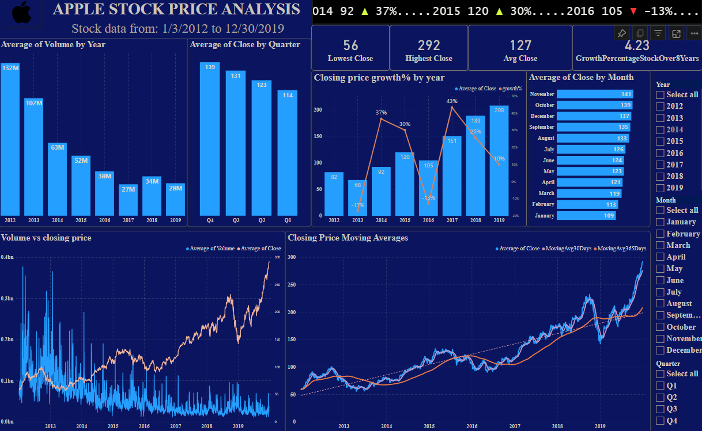

# Apple Stock Price Forecasting Model
# Business Objective:
Predict the apple stock market price for the next 30 days.
There are Open, High, Low and Close prices that have been given for each day starting from 2012 to 2019 for Apple stock.

Date: stock price date
Open: Opening price of the day
High: Maximum price of the day
Low : Minimum price of the day
Close : Closing price of the day  ---> Target variable
Adj Close : Adjusted closing of the day
Volume: total share cost from all the shareholders

# Tools Used
- Python: Pandas, NumPy, Scikit-learn for data preprocessing and feature engineering
- TensorFlow/Keras: For developing and training the Long Short-Term Memory (LSTM) model
# Solution 
- Collected and cleaned historical stock price data, addressing missing values and normalizing features for model optimization.
- Designed an LSTM model architecture to effectively capture temporal dependencies in the stock price data.
- Split the dataset into training, validation, and test sets for robust evaluation of the model's performance.
- Applied hyperparameter tuning to optimize model accuracy and addressed overfitting through regularization techniques and validation strategies.
# Conclusion
The LSTM model achieved a low RMSE of 10, demonstrating high accuracy in predicting stock price movements. The project provided valuable insights into time-series forecasting and highlighted the potential of machine learning models for financial market analysis and decision-making.
# Deployment using streamlit:
https://applestockpriceforecast-uhciuywtcehznq5mgmbowr.streamlit.app/

# Apple Stock Price Analysis (2012–2019):

- Here is the static view of the dashboard:

- Link for the power bi dashboard : https://app.powerbi.com/view?r=eyJrIjoiOGU0ZWI5MGEtM2ZhNy00ZDYzLTk1YzMtNzU1MDlmYjQ4MDU0IiwidCI6IjZmOTg3MmM0LTYzZDgtNDVkMi05YjM5LWUyNjhmYjQxY2Y4ZCJ9

# Key Insights:

## Volume Trends:
- The highest average yearly volume was recorded in 2012 (132M).
- A notable decline in trading volume was observed from 2012 to 2016, stabilizing around 27M–34M after 2016.

## Closing Price Trends by Quarter:
- Quarter-wise, Q4 had the highest average close (139), followed by Q3 (131) and Q2 (123).
- Q1 consistently had the lowest average close (114).

## Yearly Growth in Closing Price:
- Significant growth was seen in 2017 (+43%), with average closing prices rising to 151.
- A decline was noted in 2015 (-13%) compared to the previous year.
- Overall growth in closing prices over 8 years was 4.23 times.

## Key Statistics:
- Lowest Close: 56
- Highest Close: 292
- Average Close: 127

## Monthly Analysis:
- November (141), October (139), and December (137) had the highest average closing prices.
- January (109) and February (113) consistently had the lowest monthly averages.

## Visualizations:

### Volume vs. Closing Price:
- There’s a consistent upward trend in the closing price from 2016 onward, even as trading volume fluctuates.
- A slight lag is observed between volume surges and price changes.

### Moving Averages:
- The 30-day moving average aligns closely with short-term price changes.
- The 365-day moving average captures long-term upward momentum in Apple stock prices, showing strong growth after 2016.

## Overall:
- Apple stock demonstrated strong price growth from 2012 to 2019, with notable surges after 2016.
- While trading volumes declined over the years, the stock price showed consistent appreciation, indicating increased investor confidence and value.

